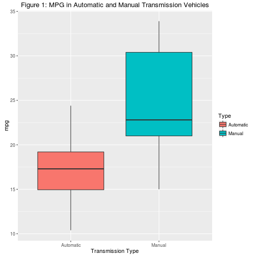
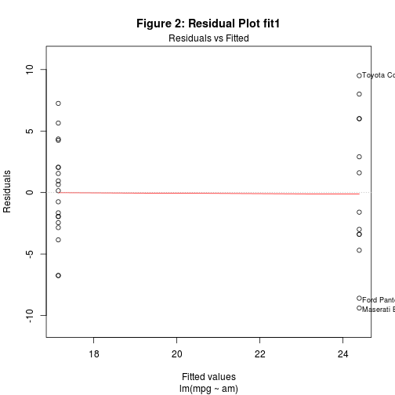
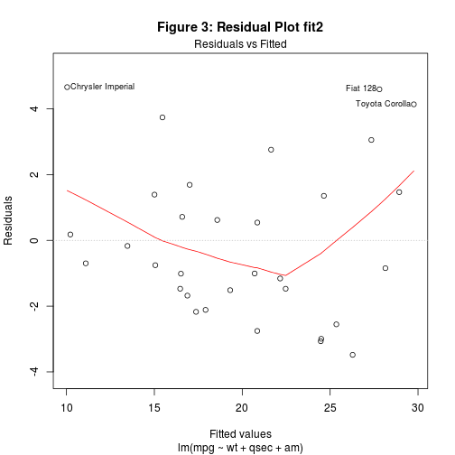

## Executive Summary 

We will examine the `mtcars` data with a goal to fit a linear model to determine if automatic or manual transmission is better for fuel efficiency ("mpg") and we will quantify the difference should it exist.

--- .class #id 

## Data Exploration and Preparation


```r
data(mtcars); mtcars$am <- factor(mtcars$am)
mtcars$vs <- factor(mtcars$vs)
mtcars$gear <- factor(mtcars$gear)
mtcars$cyl <- factor(mtcars$cyl); mtcars$carb <- factor(mtcars$carb)
```
Data Variables: mileage (`mpg`), number of cylinders (`cyl`), 
displacement (`disp`), horse power (`hp`), rear axle ratio (`drat`), 
weight (`wt`), 1/4 mile time (`qsec`), cylinder arrangement (`vs`) , transmission type (`am`), number of forward gears (`gear`) and number of carburetors (`carb`) for 32 different vehicle models.

---

## Str() of the Data


```r
str(mtcars)
```

```
## 'data.frame':	32 obs. of  11 variables:
##  $ mpg : num  21 21 22.8 21.4 18.7 18.1 14.3 24.4 22.8 19.2 ...
##  $ cyl : Factor w/ 3 levels "4","6","8": 2 2 1 2 3 2 3 1 1 2 ...
##  $ disp: num  160 160 108 258 360 ...
##  $ hp  : num  110 110 93 110 175 105 245 62 95 123 ...
##  $ drat: num  3.9 3.9 3.85 3.08 3.15 2.76 3.21 3.69 3.92 3.92 ...
##  $ wt  : num  2.62 2.88 2.32 3.21 3.44 ...
##  $ qsec: num  16.5 17 18.6 19.4 17 ...
##  $ vs  : Factor w/ 2 levels "0","1": 1 1 2 2 1 2 1 2 2 2 ...
##  $ am  : Factor w/ 2 levels "0","1": 2 2 2 1 1 1 1 1 1 1 ...
##  $ gear: Factor w/ 3 levels "3","4","5": 2 2 2 1 1 1 1 2 2 2 ...
##  $ carb: Factor w/ 6 levels "1","2","3","4",..: 4 4 1 1 2 1 4 2 2 4 ...
```

---

## Boxplot Automatic v. Manual Transmission



---

## Model 1: Automatic Transmission v. Manual and MPG


```r
mpg_fit1 <- lm(mpg ~ am, mtcars)
summary(mpg_fit1)$r.squared
```

```
## [1] 0.3597989
```

$R^{2}$ indicates this model is deficient in explaining the variance in the data around its mean.  

---

## Model 2: Step Function to find Critical Variables

We will use the `step()` function to find a model with an improved $R^{2}$ value.  The `step()` function will indicate the best fit using the AIC method.  It will check each variable in the model to find one with the best fit according to the AIC value.  The final model is below.


```r
best <- step(lm(mpg~.,mtcars), direction = "both")
```


```r
summary(best)$call
```

```
## lm(formula = mpg ~ cyl + hp + wt + am, data = mtcars)
```

```r
mpg_fit2 <- lm(mpg ~ wt + qsec + am, mtcars)
```

---

## Results from the Step() Function


```
## 
## Call:
## lm(formula = mpg ~ wt + qsec + am, data = mtcars)
## 
## Residuals:
##     Min      1Q  Median      3Q     Max 
## -3.4811 -1.5555 -0.7257  1.4110  4.6610 
## 
## Coefficients:
##             Estimate Std. Error t value Pr(>|t|)    
## (Intercept)   9.6178     6.9596   1.382 0.177915    
## wt           -3.9165     0.7112  -5.507 6.95e-06 ***
## qsec          1.2259     0.2887   4.247 0.000216 ***
## am1           2.9358     1.4109   2.081 0.046716 *  
## ---
## Signif. codes:  0 '***' 0.001 '**' 0.01 '*' 0.05 '.' 0.1 ' ' 1
## 
## Residual standard error: 2.459 on 28 degrees of freedom
## Multiple R-squared:  0.8497,	Adjusted R-squared:  0.8336 
## F-statistic: 52.75 on 3 and 28 DF,  p-value: 1.21e-11
```

---

## Comments on the results of the Step() function


```r
summary(mpg_fit2)$adj.r.squared
```

```
## [1] 0.8335561
```

The model returned by the `step()` function (above), gives an Adjusted $R^{2}$ indicating that this model explains 83% of the variance of the data around its mean, so this model is much stronger than the earlier fit.

---

## ANOVA on the models

Coefficients are statistically significant compared to the model that does not include them.


```r
mpg_fit1.a <- lm(mpg ~ am + qsec, mtcars)
anova(mpg_fit1, mpg_fit1.a, mpg_fit2)
```

```
## Analysis of Variance Table
## 
## Model 1: mpg ~ am
## Model 2: mpg ~ am + qsec
## Model 3: mpg ~ wt + qsec + am
##   Res.Df    RSS Df Sum of Sq      F    Pr(>F)    
## 1     30 720.90                                  
## 2     29 352.63  1    368.26 60.911 1.679e-08 ***
## 3     28 169.29  1    183.35 30.326 6.953e-06 ***
## ---
## Signif. codes:  0 '***' 0.001 '**' 0.01 '*' 0.05 '.' 0.1 ' ' 1
```

---

## Residual Plot 1



---

## Residual Plot 2



---

## Comments on Residual Plots

1. Comparing Figure 2 and Figure 3 - more heteroskedacity in the best fit from the `Step()` function.

2. Figure 3 indicates several outliers Chrysler Imperial, Fiat 128 and Toyota Corolla which we may wish to exclude.

---

## Conclusions


```r
summary(mpg_fit2)$coefficients
```

```
##              Estimate Std. Error   t value     Pr(>|t|)
## (Intercept)  9.617781  6.9595930  1.381946 1.779152e-01
## wt          -3.916504  0.7112016 -5.506882 6.952711e-06
## qsec         1.225886  0.2886696  4.246676 2.161737e-04
## am1          2.935837  1.4109045  2.080819 4.671551e-02
```

1. Manual transmission contributes to lower gas mileage

2. The `am1` factor is significant at $\alpha = .05$ confirming the relationship.

3. With weight (`wt`) and 1/4 mile time (`qsec`) held constant, average of 2.9358 increase in mpg when using a manual transmission.

4. Coefficients are significant with 95% confidence.
